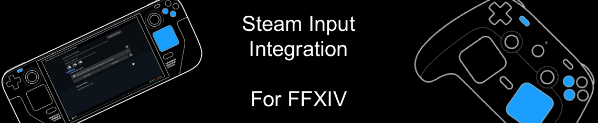

# Steam Integration for Final Fantasy XIV

This project is an integration of Steam Input to support custom actions through steam input binding.

This will allow you run dalamud plugin commands from your steam input radial wheel's without the need to interupt gameplay 
with text macro's that open the chat and type a string.